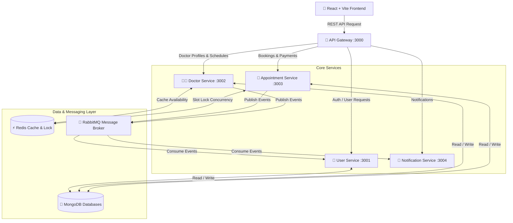

# 🏥 DoctorConnect (Doctor Patient Management System)


---

## 📌 Table of Contents

- [Overview](#-overview)
- [System Architecture](#-system-architecture)
- [Key Features](#-key-features)
- [Technology Stack](#-technology-stack)
- [Microservices Infrastructure](#-microservices-infrastructure)
- [Event-Driven Architecture](#-event-driven-architecture)
- [Security & Environment Isolation](#-security--environment-isolation)
- [Getting Started & Installation](#-getting-started--installation)
  - [Prerequisites](#prerequisites)
  - [Method 1: Running Containerized (Docker Compose)](#method-1-running-containerized-docker-compose)
  - [Method 2: Running Locally (Powershell Script)](#method-2-running-locally-powershell-script)
- [Environment Variables Configuration](#-environment-variables-configuration)
- [API Routes Reference](#-api-routes-reference)
- [Folder Structure](#-folder-structure)
- [Database Models](#-database-models)
- [Troubleshooting & Helpful Scripts](#-troubleshooting--helpful-scripts)
- [License](#-license)

---

## 🌐 Overview

**DoctorConnect** is an enterprise-grade, microservices-driven healthcare and doctor appointment management platform. Built to bridge the gap between patients, healthcare providers, and administrators, DoctorConnect provides end-to-end appointment scheduling, Redis-backed slot concurrency locking, online payment processing via Razorpay, automated email notifications, and an admin verification pipeline for doctors.

The application leverages an **event-driven microservice architecture** built with Node.js, Express, React (Vite), MongoDB, Redis, and RabbitMQ, orchestrated via Docker and Docker Compose.

---

## 🏗️ System Architecture



---

## ✨ Key Features

### 👨‍🦱 Patient Features
- **Doctor Directory & Filtering**: Search and filter doctors by specialization, experience, fees, and location.
- **Interactive Calendar & Slot Booking**: Select available dates and time slots dynamically cached in Redis.
- **Atomic Slot Locking**: Concurrency control prevents double-booking using Redis-backed locks.
- **Integrated Payments**: Online booking fee payment integrated with **Razorpay**.
- **Appointment History & PDF Downloads**: View active, completed, or cancelled appointments and generate digital PDF receipts/prescriptions.
- **Virtual Consultation Room**: Integrated video room access for scheduled consultations.

### 👩‍⚕️ Doctor Features
- **Doctor Onboarding & Verification**: Multi-step registration submitting credentials for admin verification.
- **Availability Management**: Set recurring weekly availability, specific working hours, and time slot durations.
- **Dashboard & Patient Roster**: View upcoming patient appointments, manage status (Pending, Confirmed, Completed, Cancelled).
- **Profile Customization**: Update bio, consultation fees, hospital affiliation, and specializations.

### 🛡️ Admin Features
- **Doctor Verification Queue**: Review pending doctor applications, inspect certificates, and approve/reject credentials.
- **User Management**: Monitor patient and doctor user accounts across the system.
- **System Metrics**: Real-time stats on registered users, active appointments, and pending approvals.

---

## 💻 Technology Stack

| Domain | Technology / Library |
| :--- | :--- |
| **Frontend** | React 18, Vite, CSS Flexbox/Grid, Lucide Icons, Axios, Razorpay SDK |
| **API Gateway** | Express.js, Http-Proxy-Middleware, JSON Web Tokens (JWT), Winston Logger |
| **Backend Services** | Node.js, Express.js, Mongoose ODM |
| **Databases** | MongoDB 7.0 (Isolated databases per service: `user_db`, `doctor_db`, `appointment_db`) |
| **Caching & Locking** | Redis 7 (Slot locking, fast doctor schedule lookups) |
| **Message Broker** | RabbitMQ 3.12 (AMQP event-driven pub/sub) |
| **Email Service** | Nodemailer (SMTP integration with Gmail / Custom Relay) |
| **Containerization** | Docker, Docker Compose |

---

## 🧩 Microservices Infrastructure

DoctorConnect enforces strict separation of concerns across 5 decoupled services:

1. **API Gateway (`port: 3000`)**: Single point of entry. Handles JWT authentication, request routing, header forwarding, rate limiting, and centralized error logging.
2. **User Service (`port: 3001`)**: Manages authentication (Register/Login), user profiles, bcrypt password hashing, JWT generation, and admin accounts.
3. **Doctor Service (`port: 3002`)**: Stores verified doctor profiles, pending verification requests, specializations, and schedule availability. Caches slot availability in Redis.
4. **Appointment Service (`port: 3003`)**: Handles appointment creation, status workflow state transitions, Razorpay checkout verification, Redis atomic slot locks, and PDF prescription generation.
5. **Notification Service (`port: 3004`)**: Asynchronous worker consuming RabbitMQ events to dispatch confirmation email notifications to patients and doctors.

---

## 📡 Event-Driven Architecture

DoctorConnect uses AMQP topics in RabbitMQ to communicate state changes asynchronously:

| Event Name | Exchange / Queue | Publisher | Subscribers | Action Triggered |
| :--- | :--- | :--- | :--- | :--- |
| `DOCTOR_REGISTERED` | `doctor_events` | User Service | Doctor Service | Creates pending doctor verification record |
| `DOCTOR_VERIFIED` | `doctor_events` | Doctor Service | User Service | Activates doctor user status in Auth database |
| `APPOINTMENT_CREATED` | `appointment_events` | Appointment Service | Notification Service | Sends booking confirmation email |
| `APPOINTMENT_CANCELLED`| `appointment_events` | Appointment Service | Notification Service | Sends cancellation notice & releases slot |
| `PAYMENT_SUCCESSFUL` | `payment_events` | Appointment Service | Notification Service | Dispatches payment receipt email |

---

## 🔒 Security & Environment Isolation

> [!IMPORTANT]
> **Zero Credentials in Repository Policy**: No secret keys, passwords, API secrets, or live database connection strings are committed to source control.

All sensitive data must be passed via local `.env` files or environment variables.

- **`.gitignore` Integration**: Strictly ignores `.env`, `*.env`, `node_modules/`, `logs/`, `dist/`, and local temporary files.
- **`.env.example` Templates**: Sanitized reference templates are provided for local setup.
- **Database Separation**: Microservices use separate logical databases (`user_db`, `doctor_db`, `appointment_db`) to enforce domain-driven design.
- **JWT Protection**: Secure authentication tokens passed via HTTP `Authorization: Bearer <token>` headers.

---

## 🚀 Getting Started & Installation

### Prerequisites

Ensure you have the following installed on your machine:
- **Node.js** (v18.x or higher)
- **npm** (v9.x or higher)
- **Docker Desktop** (Required for Docker method)
- **PowerShell** (For Windows local script execution)

---

### Method 1: Running Containerized (Docker Compose)

The easiest way to spin up the entire infrastructure (Databases, Message Broker, Cache, 4 Microservices, API Gateway, and Frontend) is using Docker Compose:

1. **Clone the repository**:
   ```bash
   git clone https://github.com/your-username/DocterConnect.git
   cd DocterConnect
   ```

2. **Configure Environment Variables**:
   Create a `.env` file in the project root by copying `.env.example`:
   ```bash
   cp .env.example .env
   ```

3. **Launch all services via Docker**:
   ```bash
   docker compose up --build
   ```

4. **Access the application**:
   - **Frontend UI**: [http://localhost:5173](http://localhost:5173)
   - **API Gateway**: [http://localhost:3000](http://localhost:3000)
   - **RabbitMQ Management Dashboard**: [http://localhost:15672](http://localhost:15672) (User: `admin` / Pass: `admin123`)

---

### Method 2: Running Locally (Powershell Script)

If you prefer running services locally for development:

1. **Ensure local prerequisites are running**:
   - MongoDB running on `localhost:27017`
   - Redis running on `localhost:6379`
   - RabbitMQ running on `localhost:5672`

2. **Run the local starter script**:
   ```powershell
   .\start-local.ps1
   ```

This script will automatically generate service-level `.env` files and spawn 6 separate terminal windows running each microservice and the frontend dev server.

---

## 🛠️ Environment Variables Configuration

Place environment configuration in your `.env` file:

```env
# Infrastructure Connections
MONGODB_URI_USER=mongodb://localhost:27017/user_db
MONGODB_URI_DOCTOR=mongodb://localhost:27017/doctor_db
MONGODB_URI_APPOINTMENT=mongodb://localhost:27017/appointment_db

REDIS_URL=redis://localhost:6379
RABBITMQ_URL=amqp://localhost:5672

# Security Keys
JWT_SECRET=dpm_jwt_secret_key_2024
JWT_EXPIRES_IN=7d

# Payment Integration (Razorpay)
RAZORPAY_KEY_ID=your_razorpay_key_id
RAZORPAY_KEY_SECRET=your_razorpay_key_secret

# Email Notifications (SMTP)
SMTP_HOST=smtp.gmail.com
SMTP_PORT=587
SMTP_USER=your_email@gmail.com
SMTP_PASS=your_app_password
```

---

## 🛣️ API Routes Reference

All API requests route through the Gateway at `http://localhost:3000/api`.

### 👤 User Service Routes (`/api/users`)
- `POST /api/users/register` - Register a new patient or doctor account
- `POST /api/users/login` - Authenticate user and receive JWT token
- `GET /api/users/profile` - Fetch current user profile details
- `PUT /api/users/profile` - Update profile information

### 👨‍⚕️ Doctor Service Routes (`/api/doctors`)
- `GET /api/doctors` - Retrieve list of verified doctors (supports query filters)
- `GET /api/doctors/:id` - Fetch doctor profile details and availability
- `PUT /api/doctors/availability` - Update doctor working schedule
- `GET /api/doctors/pending` - *(Admin)* List pending doctor verification applications
- `POST /api/doctors/verify/:id` - *(Admin)* Approve or reject a doctor account

### 📅 Appointment Service Routes (`/api/appointments`)
- `POST /api/appointments/book` - Lock slot in Redis & create pending appointment
- `POST /api/appointments/verify-payment` - Verify Razorpay signature & confirm booking
- `GET /api/appointments/patient` - List patient appointments
- `GET /api/appointments/doctor` - List doctor appointments
- `PUT /api/appointments/:id/status` - Update appointment status (Confirmed/Completed/Cancelled)

---

## 📁 Folder Structure

```
DocterConnect/
├── .env.example                  # Environment configuration template
├── .gitignore                    # Git exclusion definitions
├── docker-compose.yml            # Multi-container orchestration specification
├── start-local.ps1               # Automated local dev setup script
├── api-gateway/                  # Express API Gateway & Proxy Layer
│   ├── src/
│   │   ├── middleware/           # Auth & error handling middleware
│   │   ├── routes/               # Proxy router
│   │   └── server.js             # Gateway entrypoint
│   └── Dockerfile
├── services/
│   ├── user-service/             # User Management & Authentication Microservice
│   ├── doctor-service/           # Doctor Profile & Availability Microservice
│   ├── appointment-service/      # Appointment Booking & Payment Microservice
│   └── notification-service/     # AMQP Email Notification Microservice
├── frontend/                     # React + Vite Single Page Application
│   ├── src/
│   │   ├── components/           # Reusable UI components
│   │   ├── context/              # Auth & global state context
│   │   ├── pages/                # Page views (Dashboard, Booking, Auth, etc.)
│   │   └── services/             # Axios API client modules
│   └── Dockerfile
└── README.md                     # Documentation
```

---

## ⚡ Database Models

```
User Schema (user_db)
├── _id (ObjectId)
├── firstName (String)
├── lastName (String)
├── email (String, Unique)
├── password (String, Hashed)
├── role ('patient' | 'doctor' | 'admin')
└── isActive (Boolean)

Doctor Schema (doctor_db)
├── _id (ObjectId)
├── userId (String, Ref User)
├── specialization (String)
├── experienceYears (Number)
├── consultationFee (Number)
├── availabilitySchedule (Array of slots)
└── isVerified (Boolean)

Appointment Schema (appointment_db)
├── _id (ObjectId)
├── patientId (String)
├── doctorId (String)
├── appointmentDate (Date)
├── timeSlot (String)
├── amount (Number)
├── status ('pending' | 'confirmed' | 'completed' | 'cancelled')
├── razorpayOrderId (String)
└── razorpayPaymentId (String)
```

---

## 💡 Troubleshooting & Helpful Scripts

- **Reset / Wipe Test Data**:
  ```bash
  node tmp/cleanup_data.js
  ```
- **Create Admin User**:
  ```bash
  node services/user-service/create-admin.js
  ```
- **Check Mongo Connection**:
  ```bash
  node check-users.js
  ```

---

## 📄 License

This project is open-source and licensed under the [MIT License](LICENSE).
